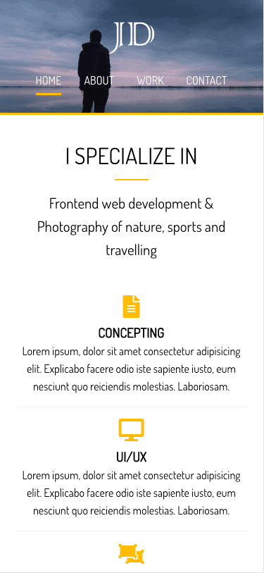
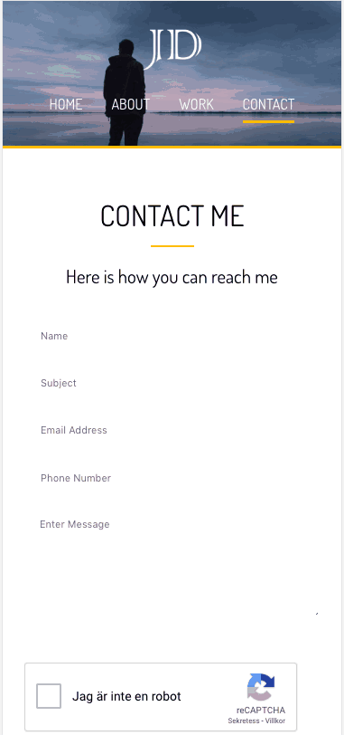

# Portfolio website for Mr John Doe

A portfolio website built with SaSS. It has index, work, about and contact pages.

Icons are taken from fontawesome.

There is a typewriter script on the index page.

Media queries have been added to make it mobile friendly (horizontal and landscape). 

## Screenshots

Index page

About page

Work & Contact pages

On Mobile, Index and About

On Mobile, Work and Contact

## Author
* Albert Stjärne (https://github.com/AlbertStjarne)